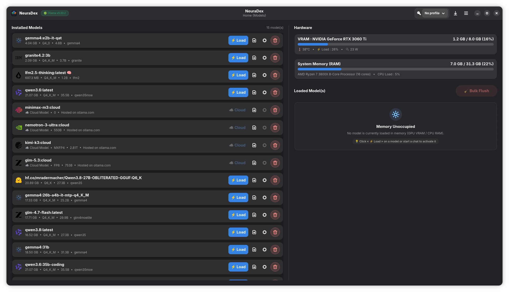
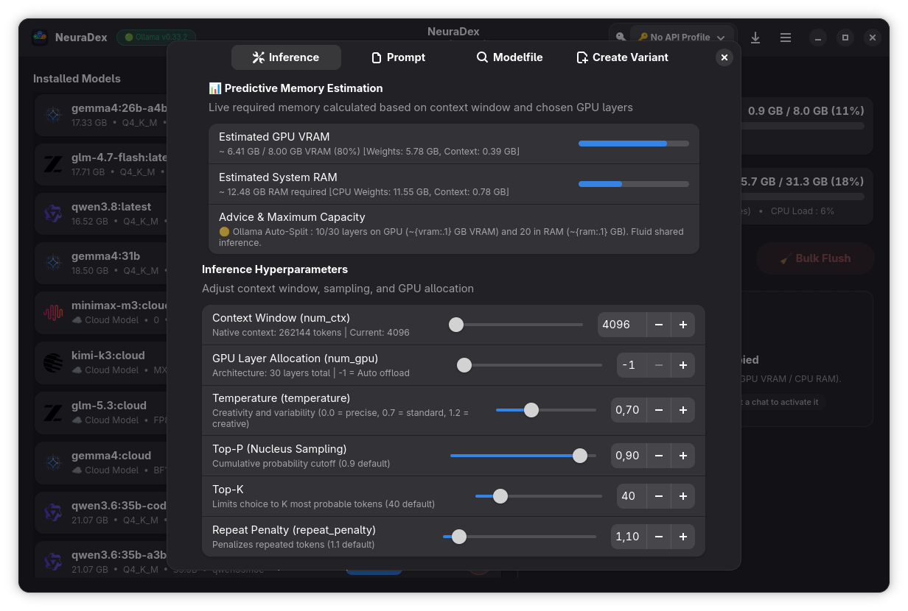
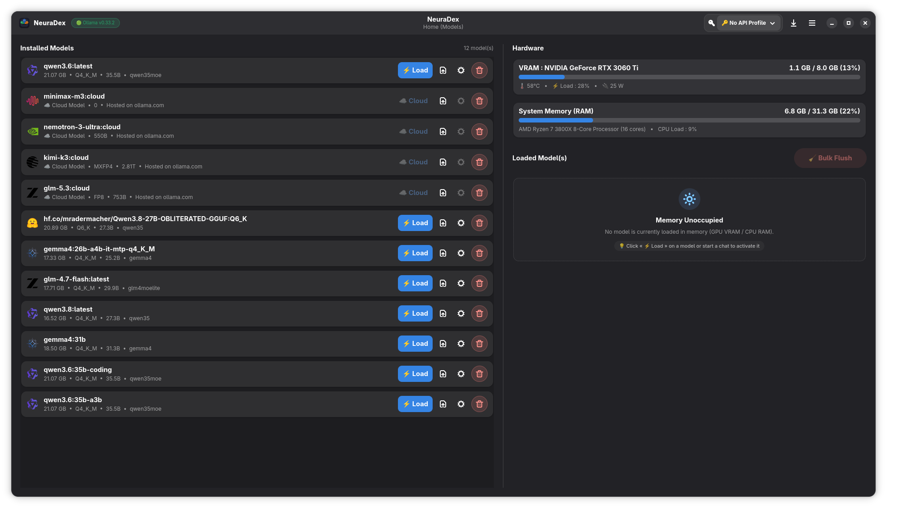
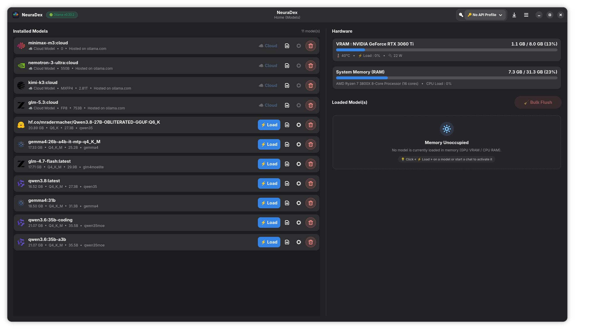
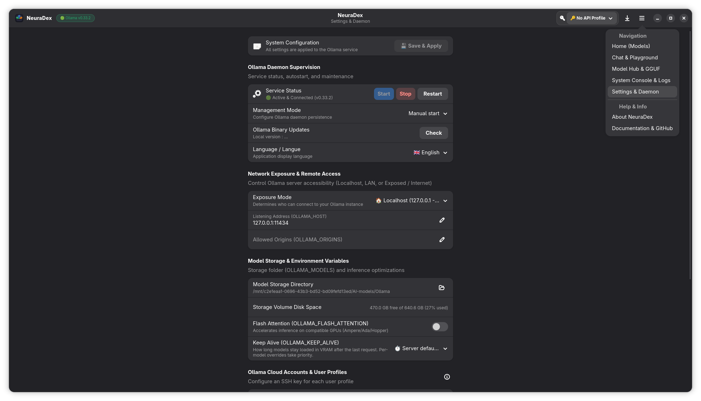

# NeuraDex

<p align="center">
  <a href="../../README.md">🇬🇧 English</a> | <b>🇫🇷 Français</b>
</p>

<p align="center">
  
</p>

<p align="center">
  <strong>Application de bureau Linux native pour Ollama : gestion de modèles, supervision système et tests d'IA locale</strong>
</p>

<p align="center">
  
  
  
  
  
</p>

---

## Présentation

**NeuraDex** est une application de bureau Linux native écrite en **Rust** avec **GTK4 & Libadwaita**.

Elle offre une interface de bureau pour piloter vos environnements **Ollama** locaux : surveiller la VRAM GPU et la mémoire système en temps réel, décharger les modèles à la demande, configurer le daemon et les paramètres réseau, explorer le catalogue avec estimation de l'empreinte mémoire, télécharger des fichiers GGUF depuis Hugging Face, ajuster les hyperparamètres d'inférence par modèle et tester vos prompts via une interface de chat intégrée.

---

## Fonctionnalités principales

### 🖥️ 1. Supervision matérielle & Gestion des modèles
- **Supervision multi-GPU & Système** : Métriques VRAM par GPU (utilisée, totale, température, charge, consommation électrique) avec calculs agrégés multi-GPU, ainsi que l'utilisation de la RAM système et du processeur (CPU).
- **Estimation de l'empreinte mémoire** : Évalue les besoins mémoire d'un modèle avant son chargement :
  - 🟢 **100% VRAM GPU** : Toutes les couches du modèle tiennent entièrement dans la mémoire vidéo.
  - 🟡 **Hybride CPU/GPU** : Les couches du modèle sont réparties entre la VRAM GPU et la mémoire vive (RAM).
  - 🔴 **Mémoire insuffisante** : Avertit lorsque les besoins mémoire dépassent la capacité maximale du système.
- **Modèles chargés & Gestion de la mémoire** : Cartes en temps réel affichant les modèles actuellement en mémoire avec répartition VRAM/RAM, compte à rebours d'expiration du keep-alive et bouton **`🧹 Tout décharger`** pour libérer immédiatement la mémoire.
- **Bibliothèque de modèles installés** : Vue d'ensemble des modèles Ollama installés localement avec nombre de paramètres, niveaux de quantification, tailles et badges de capacités (`think`, `vision`, `tools`, `code`, `embeddings`).
- **Préchargement de modèle** : Chargez n'importe quel modèle en mémoire GPU/système directement depuis sa carte avec retour visuel de progression, le préparant à une inférence immédiate.

<p align="center">
  
</p>

### ⚙️ 2. Paramètres & Personnalisation des modèles
- **Contrôles de paramètres synchronisés** : Ajustez les hyperparamètres (`temperature`, `top_p`, `top_k`, `num_ctx`, `repeat_penalty`, `num_gpu`) avec des curseurs et des champs numériques synchronisés.
- **Déchargement des couches GPU** : Détecte l'architecture en couches du modèle (`block_count`) pour définir le nombre exact de couches déchargées en VRAM, ou forcer `num_gpu = 0` pour une exécution 100% CPU.
- **Prompts système & Variantes de modèles** : Définissez des instructions système persistantes, personnalisez les templates de prompt et créez de nouvelles entrées de modèles dans Ollama (`/api/create`) avec leurs configurations sauvegardées.

<p align="center">
  
</p>

### 📚 3. Hub de modèles & Téléchargeur GGUF Hugging Face
- **Omnibar intelligente unifiée** : Barre de recherche compacte fusionnant le filtrage instantané du catalogue local, la détection automatique des liens Hugging Face (`hf.co/...`, `auteur/modèle`) pour explorer les quantifications GGUF, et le téléchargement direct de modèles Ollama non référencés.
- **Catalogue de modèles** : Parcourez les modèles officiels et communautaires avec métadonnées, quantifications disponibles (`Q4_K_M`, `FP16`, `Q8_0`), fenêtres de contexte et badges de capacités (`think`, `vision`, `tools`, `code`, etc.).
- **Sélecteur GGUF Hugging Face** : Collez une URL de dépôt Hugging Face ou un identifiant (`auteur/modèle` ou `hf.co/...`) pour explorer les quantifications GGUF disponibles avec vérification des tailles et de la compatibilité mémoire.
- **Filtre matériel** : Filtrez le catalogue pour masquer automatiquement les modèles dépassant la capacité mémoire locale.
- **Téléchargements directs et résilients** : Téléchargement en flux continu direct des modèles GGUF depuis Hugging Face avec reprise HTTP Range, évitant les problèmes de timeout du daemon Ollama.

> [!TIP]
> **Modèles volumineux (> 17 Go) & Jeton Hugging Face** :
> Bien que les modèles publics puissent être téléchargés anonymement, Hugging Face bride fréquemment le débit ou coupe les connexions non authentifiées sur les fichiers volumineux (> 17 Go). Pour garantir une vitesse maximale et éviter les limitations de débit, il est fortement recommandé de configurer un token gratuit Hugging Face (`hf_...`) dans **Paramètres > Profils API / Coffre-fort**.

<p align="center">
  
</p>

<p align="center">
  
</p>

### 🖧 4. Configuration du service, Stockage & Clés
- **Supervision du daemon** : Vérifiez le statut du service, démarrez, arrêtez ou redémarrez le service systemd Ollama.
- **Options d'exécution Ollama** : Activez Flash Attention (`OLLAMA_FLASH_ATTENTION`) et configurez les règles de rétention mémoire (`OLLAMA_KEEP_ALIVE`).
- **Dossier de stockage des modèles** : Configurez l'emplacement de `OLLAMA_MODELS` avec indicateurs d'espace disque et outil de migration intégré avec suivi de progression.
- **Sélecteur d'exposition réseau** :
  - 🔒 **Localhost uniquement** (`127.0.0.1`) pour un usage strictement local.
  - 🏠 **Réseau local (LAN)** (`0.0.0.0`) pour partager l'accès sur votre réseau local.
  - 🌐 **Exposé / Internet** (`0.0.0.0` avec politique CORS `OLLAMA_ORIGINS=*`).
- **Stockage sécurisé des identifiants** : Stockez vos clés API via le Secret Service FreeDesktop (**GNOME Keyring** & **KDE KWallet**) avec repli sur fichier local protégé (`chmod 0600`), et appliquez vos clés dans la configuration drop-in systemd.
- **Clés SSH membres** : Générez des paires de clés SSH Ed25519 (`~/.ollama/id_ed25519_{member}`) pour vos comptes Ollama avec copie rapide dans le presse-papier.
- **Journaux système en direct** : Visualisez les logs du service en temps réel via `journalctl -u ollama.service` avec coloration syntaxique, recherche et filtrage par niveau de log.
- **Rapport de diagnostic** : Générez et inspectez un rapport d'environnement complet au format Markdown (OS, noyau, session Wayland/X11, CPU, VRAM/températures GPU, configuration Ollama, modèles chargés) pour faciliter le dépannage ou joindre aux rapports de bugs.
- **Langue & Mises à jour** : Interface bilingue (anglais et français) avec détection automatique de la langue du système, et vérification des nouvelles versions via l'API GitHub.

<p align="center">
  
</p>

### 🧪 5. Interface de chat pour le test de modèles
> [!NOTE]
> NeuraDex est principalement conçu pour la gestion de modèles et la supervision système. Une interface de chat intégrée est incluse pour tester rapidement vos prompts, inspecter les réponses et mesurer les performances d'inférence sans outils tiers.

- **Chat interactif** : Interface de conversation asynchrone avec historique des sessions et streaming en temps réel.
- **Métriques d'inférence** : Vitesse de génération en temps réel (tokens/seconde), temps jusqu'au premier token (TTFT) et suivi de la mémoire pendant l'inférence.
- **Menu contextuel de paramètres éphémères** : Ajustez la température, la fenêtre de contexte et le prompt système lors de vos tests sans modifier la configuration globale du modèle.
- **Titres de session automatiques** : Génération intelligente du titre de session à partir du premier message utilisateur (avec prise en charge du français et de l'anglais).

---

## 🧩 Compatibilité matérielle

| Plateforme | Jauges VRAM / Mémoire | Calcul & Charge | Consommation | Température | Statut |
| :--- | :---: | :---: | :---: | :---: | :--- |
| **NVIDIA** | ✅ NVML | ✅ NVML | ✅ NVML | ✅ NVML | Testé & Fonctionnel |
| **AMD Radeon** | ✅ `amdgpu` sysfs | ✅ sysfs | ✅ `hwmon` | ✅ `hwmon` | Implémenté (Retours communautaires bienvenus) |
| **Intel Arc / iGPU** | ✅ `xe` / `i915` sysfs | ✅ sysfs | ✅ `hwmon` | ✅ `hwmon` | Implémenté (Retours communautaires bienvenus) |

> [!NOTE]
> **Retours communautaires recherchés (GPU AMD & Intel)** : Je ne dispose plus actuellement d'accès physique à du matériel AMD Radeon ni Intel Arc. Les backends de surveillance AMD et Intel ont été conçus selon les spécifications officielles Linux `sysfs`/`hwmon` et validés par des suites de tests automatisées, mais n'ont pas encore été testés sur des machines physiques réelles. **Les retours, logs et signalements d'utilisateurs AMD et Intel sont très appréciés !**

---

## 🚀 Installation

### Installation rapide (One-liner)
Pour Debian, Ubuntu, Fedora, Arch Linux et dérivés :
```bash
curl -fsSL https://raw.githubusercontent.com/BazinFla/Neuradex/main/scripts/get.sh | bash
```
*(Détecte automatiquement votre distribution, télécharge le paquet officiel `.deb`, `.rpm` ou `.pkg.tar.zst` depuis les Releases GitHub et l'installe).*

---

### Installation manuelle de paquets

#### Fedora & dérivés (.rpm)
Téléchargez le dernier `.rpm` depuis les [Releases](https://github.com/BazinFla/Neuradex/releases) et installez-le :
```bash
sudo dnf install ./neuradex-*.rpm
```

#### Debian / Ubuntu & dérivés (.deb)
Téléchargez le dernier `.deb` depuis les [Releases](https://github.com/BazinFla/Neuradex/releases) et installez-le :
```bash
sudo apt install ./neuradex_*_amd64.deb
```

#### Arch Linux & dérivés (.pkg.tar.zst)
Téléchargez le dernier `.pkg.tar.zst` depuis les [Releases](https://github.com/BazinFla/Neuradex/releases) et installez-le :
```bash
sudo pacman -U ./neuradex-*-x86_64.pkg.tar.zst
```
Ou compilez localement avec le `PKGBUILD` inclus :
```bash
makepkg -si
```

<details>
<summary><b>🔨 Compilation depuis les sources</b></summary>

#### Dépendances requises

##### Debian / Ubuntu / Pop!_OS
```bash
sudo apt update
sudo apt install -y build-essential libgtk-4-dev libadwaita-1-dev libssl-dev pkg-config
```

##### Fedora / RHEL
```bash
sudo dnf install -y gcc gtk4-devel libadwaita-devel openssl-devel pkgconf-pkg-config
```

##### Arch Linux / Manjaro
```bash
sudo pacman -S --needed base-devel gtk4 libadwaita openssl pkgconf
```

#### Compiler et installer
```bash
git clone https://github.com/BazinFla/NeuraDex.git
cd NeuraDex/neuradex
cargo build --release
./scripts/install.sh
```
</details>

---

## 📄 Licence

Distribué sous la **licence GPL-3.0**. Consultez [LICENSE](../../LICENSE) pour plus d'informations.

---

## 💡 Dépannage & Réinitialisation

Pour réinitialiser la configuration de NeuraDex et restaurer les paramètres par défaut du service Ollama :
```bash
rm -rf ~/.config/neuradex
sudo rm -f /etc/systemd/system/ollama.service.d/override.conf
sudo systemctl daemon-reload
sudo systemctl restart ollama
```
